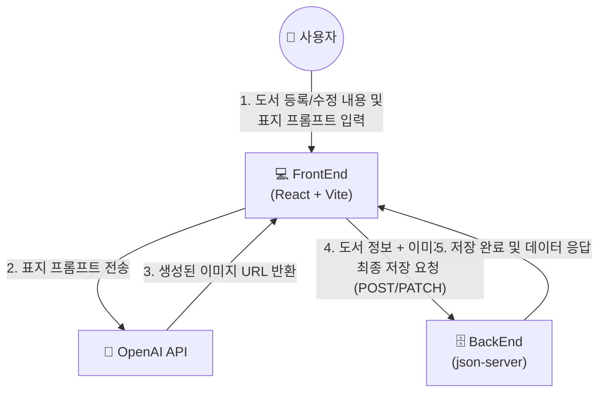

# 📖 도서 관리 시스템 README.MD
KT AIVLE School AI 트랙 미니 프로젝트 4차 FrontEnd


## 📢 프로젝트 소개
- 누구나 작가가 되어 자유롭게 글을 집필하고 공개할 수 있는 창작 플랫폼입니다.
- 책을 사랑하는 사람이라면 누구나 간편하게 이용할 수 있도록 사용자 편의 UI를 제공합니다.
- 기존 플랫폼과 달리 작가의 감성과 이야기가 그대로 반영될 수 있는 AI 표지 제작을 지원합니다.

<br>

## 🗺️ 시스템 아키텍처


<br>

## ✨ 주요 기능
### 🎨 원하는 분위기의 AI 표지 생성 기능
- 스타일/배경·조명/타이포그래피 별 태그를 선택해 간편하게 원하는 분위기의 표지 생성 가능
- 프롬프트 작성으로 추가 디테일 적용 가능
- 1회 생성에 최대 3가지 표지 샘플 제공
- 도서 등록 이후에도 언제든지 AI 표지 수정 가능
  
### ✅ 카테고리 필터링 기능
- 도서 목록 화면에서 상세 검색 기능 없이도 장르 별 필터링 편의성 제공

### 🏆 도서 랭킹 제공 기능
- 메인 화면에서 조회수가 높은 순으로 인기 도서 랭킹 제공
- 메인 화면에서 출판일자 최신 순으로 신작 랭킹 제공

<br>

## 🛠 기술 스택
### Environment
  

### Development
      

### Communication
   

<br>

## 📂 프로젝트 구조

```text
Book-management/
├── public/         # 정적 파일 (파비콘, 아이콘 등)
├── src/
│   ├── assets/     # 이미지 및 UI 에셋
│   ├── components/ # 기능 및 페이지별 UI 컴포넌트
│   │   ├── common/ # 공통 컴포넌트 (Header)
│   │   ├── detail/ # 도서 상세 정보 영역
│   │   ├── edit/   # 도서 및 AI 표지 에디터 영역
│   │   ├── list/   # 도서 목록 렌더링 및 사이드바 영역
│   │   └── main/   # 메인 화면 및 검색바 영역
│   ├── pages/      # 라우팅되는 최상위 페이지 (Home, BookList 등)
│   ├── util/       # 공통 유틸리티 (bookCoverService)
│   ├── App.jsx     # 메인 라우터 및 상태 관리
│   └── main.jsx    # React 진입점
├── .env            # 환경 변수 (API 키 설정)
├── db.json         # 백엔드 Mock 데이터 (json-server)
├── package.json    # 프로젝트 의존성 라이브러리 명세
└── README.md       # 프로젝트 소개 문서
```

<br>

## 🚀 설치 및 실행

### Requirements
- npm
- react-router-dom 
- .env 파일에 VITE_OPENAI_API_KEY= 키 입력

### Installation
```sh
$ git clone https://github.com/BcKmini/Book-management.git
$ cd Book-management
```

### Backend
```sh
$ npm install -g json-server
$ npx json-server db.json --port 5000
```

### Frontend
```sh
$ npm install
$ npm install react-router-dom
$ npm run dev
```

<br>

## 🔌 API 엔드포인트

|구분|API 이름   |유형    |REST API   |
|--|---------|------|-----------|
|조회|도서 조회    |GET   |`/books`     |
|등록|도서 등록    |POST  |`/books`     |
|수정|도서 수정    |PATCH |`/books/{id}`|
|삭제|도서 삭제    |DELETE|`/books/{id}`|
|조회|도서 상세 조회 |GET   |`/books/{id}`|
|조회|도서 조회수 증가|GET   |`/books/{id}`|
|등록|AI 표지 생성 |POST  |`/v1/images/generations`|
|수정|AI 표지 저장 |PATCH |`/books/{id}`|
|수정|AI 표지 수정 |PATCH |`/books/{id}/cover-editor`|
  
<br>

## 🖼️ 화면 구성

|메인 화면   |도서 목록   |
|--------|--------|
|        |     |
|도서 검색 기능과 도서 랭킹 제공        |사이드바에서 장르별 모아보기 기능        |
|신규 도서 등록|도서 표지 생성|
|        |        |
|제목, 저자, 내용 등 정보 입력        |태그와 프롬프트를 입력하여 원하는 AI 표지 생성        |
|도서 상세 정보|AI 표지 수정|
|        |        |
|등록한 도서 정보 내용 출력        |표지 수정도 생성 시와 동일        |

<br>

## 👥 팀원 및 R&R

|역할        |이름      |
|----------|--------|
|조장 / PM,기획|배수성     |
|UI,레이아웃   |김경민, 유지은|
|CRUD 연동   |황민서     |
|OpenAI    |박태정     |
|스타일링, QA  |이채은, 김다진|
|발표, 문서    |김다애     |
